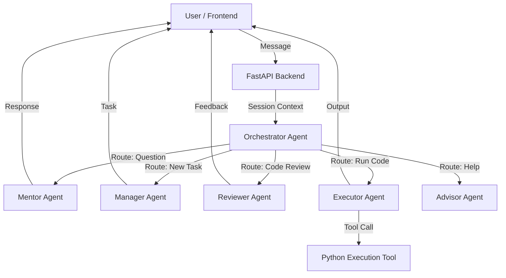

# CareerForge AI - Capstone Project

**CareerForge AI** is an intelligent, agent-powered learning platform designed to simulate a real-world coding environment. It uses a multi-agent system to mentor, manage, review, and execute code, providing users with a personalized and interactive learning experience.


## 🏆 Project Overview

This project was built for the **Kaggle Agents Intensive - Capstone Project**. It demonstrates the application of advanced AI agent concepts, including multi-agent orchestration, tool use, and session management.

### The Problem
Self-paced learning often lacks the structure and feedback of a real job. Students struggle to apply concepts in realistic scenarios and rarely get immediate, contextual feedback on their code.

### The Solution
CareerForge AI simulates a workplace environment where:
- A **Manager** assigns tasks based on your learning history.
- A **Mentor** answers questions and guides you.
- An **Executor** runs your code safely.
- A **Reviewer** provides professional code reviews.
- An **Orchestrator** routes your requests to the right agent seamlessly.

---

## 🏗️ Architecture

The system is built using a **FastAPI** backend and a **Flutter** frontend. The core intelligence is powered by **Google Gemini** models via the **Google GenAI ADK**.

### Multi-Agent System
We employ a **Router-Solver** pattern where an Orchestrator agent analyzes user input and delegates it to specialized agents.



### Key Features Implemented

1.  **Multi-Agent System**:
    *   **Orchestrator**: Intelligent routing of user intents.
    *   **Specialized Agents**: 5 distinct agents (Mentor, Manager, Reviewer, Executor, Advisor) working in parallel or sequentially.

2.  **Tools**:
    *   **Code Execution**: The `Executor` agent uses a custom Python execution tool to run user code safely.
    *   **Google Search**: (Optional/Planned) For up-to-date information.

3.  **Sessions & Memory**:
    *   **In-Memory Session Service**: Maintains conversation history and context across turns.
    *   **Context Engineering**: The Manager agent uses compacted history to generate relevant tasks.

---

## 🚀 Setup Instructions

### Prerequisites
- **Python 3.10+**
- **Flutter SDK**
- **Google API Key** (with access to Gemini models)

### 1. Backend Setup

1.  Navigate to the backend directory:
    ```bash
    cd backend
    ```

2.  Create and activate a virtual environment:
    ```bash
    python -m venv venv
    # Windows
    venv\Scripts\activate
    # Mac/Linux
    source venv/bin/activate
    ```

3.  Install dependencies:
    ```bash
    pip install -r requirements.txt
    ```

4.  **Configuration**:
    Create a `.env` file in the `backend` directory:
    ```env
    GOOGLE_API_KEY=your_api_key_here
    ```

5.  Run the server:
    ```bash
    uvicorn main:app --reload
    ```
    Server will start at `http://127.0.0.1:8000`.

### 2. Frontend Setup

1.  Navigate to the frontend directory:
    ```bash
    cd frontend
    ```

2.  Install dependencies:
    ```bash
    flutter pub get
    ```

3.  Run the application:
    ```bash
    flutter run
    ```
    Choose **Chrome** (web) or **Windows/Mac** (desktop) for the best experience.

---

## 🧪 Agent Evaluation

We have included an evaluation script to verify the performance of our agents.

1.  Ensure the backend is running.
2.  Run the evaluation script:
    ```bash
    cd backend
    python evaluation.py
    ```
    This script runs a series of test cases against the agents to verify routing, task generation, and code execution.

---

## 📂 Project Structure

```
Capstone - Project/
├── backend/
│   ├── agents/             # Agent definitions
│   │   ├── orchestrator.py
│   │   ├── mentor.py
│   │   ├── executor.py     # Includes tool usage
│   │   └── ...
│   ├── main.py             # FastAPI entry point
│   ├── tools.py            # Custom tools (Code Execution)
│   └── evaluation.py       # Agent evaluation script
├── frontend/
│   ├── lib/
│   │   ├── screens/        # UI Screens (Workstation, Classroom)
│   │   └── services/       # API integration
│   └── ...
└── README.md               # This file
```

---

## 📝 License
This project is open-source and available under the MIT License.
