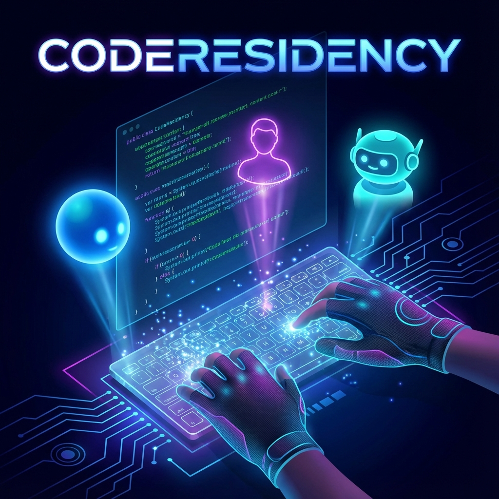
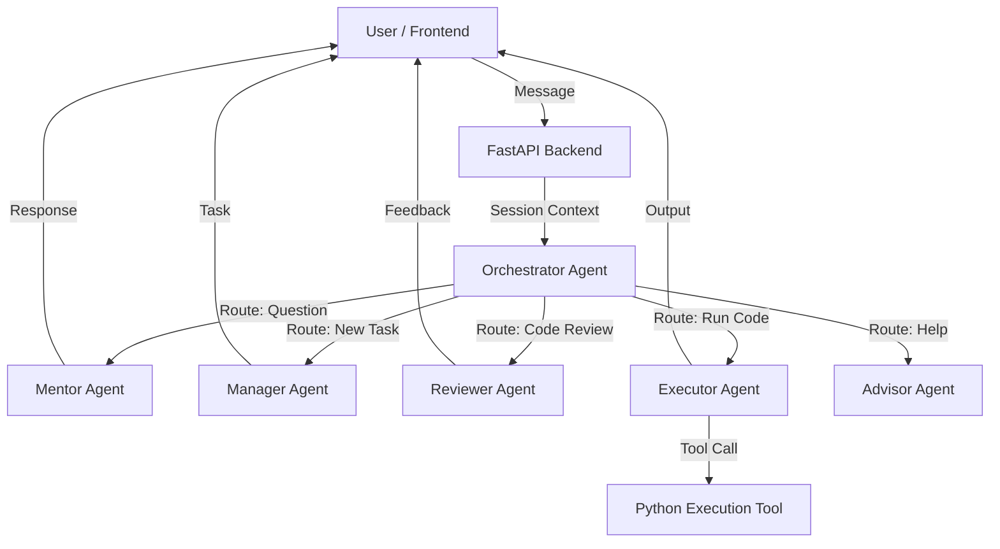

# CodeResidency - Capstone Project

## Project Overview
**CodeResidency** is an immersive, agent-powered workplace simulation that bridges the critical gap between self-paced tutorials and professional software engineering. It places you in a realistic job environment where a team of specialized AI agents—including a Manager, Mentor, Reviewer, and Executor—collaborates to assign structured tasks, provide instant feedback, and enforce industry best practices. It effectively acts as your personal internship to transform you from a student into a job-ready developer.



This project was built for the **Kaggle Agents Intensive - Capstone Project**, demonstrating advanced multi-agent orchestration, tool use, and session management.

## Problem Statement
Traditional self-paced coding education often feels isolated and theoretical. Learners watch videos and solve isolated algorithmic puzzles, but they rarely experience the dynamics of a real-world software engineering environment. They lack the structured guidance of a manager, the technical mentorship of a senior engineer, and the rigorous feedback of a code review process. This gap between learning and doing leaves many aspiring developers unprepared for the collaborative and complex nature of professional software development, leading to "tutorial hell" and a lack of confidence in building real applications.

## Solution Statement
CodeResidency bridges this gap by creating an immersive, agent-powered workplace simulation. It transforms the solitary learning process into an interactive job simulation where users work alongside a team of AI agents. A **Manager Agent** assigns realistic tasks based on the user's skill level, a **Mentor Agent** provides guidance and answers technical questions, and a **Reviewer Agent** offers professional-grade code reviews. Crucially, an **Executor Agent** runs the user's code in a secure environment, providing immediate feedback. This ecosystem allows users to experience the entire software development lifecycle—from task assignment to implementation, testing, and review—within a safe, supportive, and intelligent environment.

## Architecture
Core to CodeResidency is a sophisticated multi-agent system built using **Google's Agent Development Kit (ADK)**. It is not a simple chatbot but a coordinated ecosystem of specialized agents, each playing a distinct role in the user's development journey. The system is orchestrated by a central router that ensures the user's intent is handled by the most appropriate expert.



### Specialized Agents
*   **Task Manager (`manager_agent`)**: Acts as the user's engineering manager. Maintains project context, assigns tasks appropriate for the user's progression, and tracks status.
*   **Technical Mentor (`mentor_agent`)**: An expert senior engineer available 24/7. Answers conceptual questions and provides hints without giving away solutions.
*   **Code Reviewer (`reviewer_agent`)**: Analyzes code for correctness, style, efficiency, and best practices, providing constructive feedback similar to a professional Pull Request review.
*   **Code Executor (`executor_agent`)**: The hands-on runtime environment. Safely executes user Python code and returns standard output and errors.
*   **Orchestrator Agent**: The intelligent front-line interface that analyzes user interaction and routes it to the correct specialized agent.

## Essential Tools and Utilities
The agents are equipped with specialized tools to perform their roles effectively:

*   **Sandboxed Code Execution (`execute_python_code`)**: A critical tool used by the `executor_agent`. It allows the system to take raw Python code strings from the user, execute them in a controlled subprocess environment, and capture the output (stdout) and errors (stderr).
*   **Contextual Memory Store**: A shared memory architecture that allows all agents to access the user's session history, ensuring a seamless experience where agents are aware of previous context (e.g., the Reviewer knows what the Manager assigned).

## Setup Instructions

### Prerequisites
- Python 3.10+
- Flutter SDK
- Google API Key (with access to Gemini models)

### Backend Setup
1.  Navigate to the backend directory:
    ```bash
    cd backend
    ```
2.  Create and activate a virtual environment:
    ```bash
    python -m venv venv
    # Windows: venv\Scripts\activate
    # Mac/Linux: source venv/bin/activate
    ```
3.  Install dependencies:
    ```bash
    pip install -r requirements.txt
    ```
4.  **Configuration**: Create a `.env` file in `backend/` with:
    ```env
    GOOGLE_API_KEY=your_api_key_here
    ```
5.  Run the server:
    ```bash
    uvicorn main:app --reload
    ```

### Frontend Setup
1.  Navigate to the frontend directory:
    ```bash
    cd frontend
    ```
2.  Install dependencies:
    ```bash
    flutter pub get
    ```
3.  Run the application:
    ```bash
    flutter run
    ```

## Conclusion
CodeResidency demonstrates the transformative potential of multi-agent systems in education. By leveraging the Google ADK to orchestrate a team of specialized AI agents, we have created a platform that goes beyond static tutorials. It provides a dynamic, responsive, and personalized learning environment that mimics the real world. This approach not only teaches coding skills but also instills the professional workflows and collaborative mindset essential for a successful career in software engineering.

## Value Statement
"CodeResidency accelerated my learning by simulating the pressure and support of a real job. Instead of just writing code that 'works', I learned to write code that is clean, maintainable, and approved by a senior reviewer. The instant feedback from the Executor and the structured tasks from the Manager made me feel like I was actually contributing to a project, not just solving toy problems. It saved me months of trial and error by giving me the mentorship I couldn't afford otherwise."
